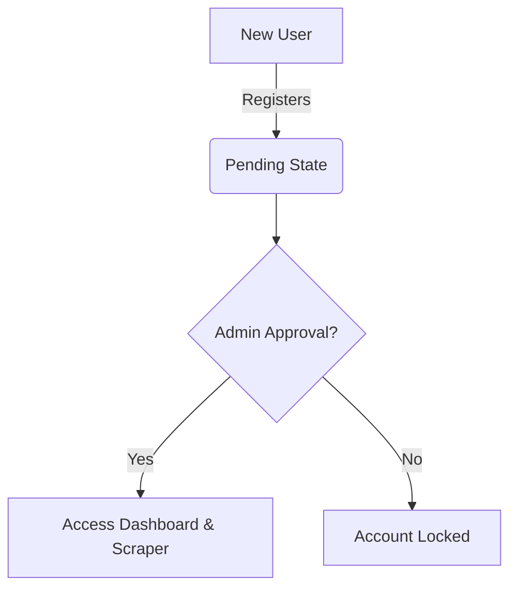
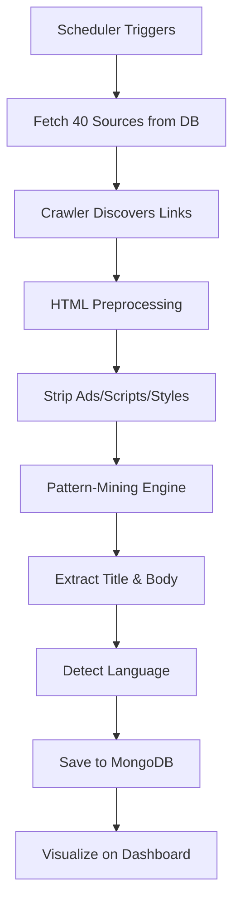

# InsightBot - Project Report

## 1. Problem Definition
In the modern digital landscape, information is abundant but structurally chaotic. News organizations and researchers struggle to extract clean data from diverse news websites due to inconsistent HTML layouts, intrusive advertisements, and varying linguistic structures. Traditional web scraping relies on hardcoded CSS selectors, which break whenever a website updates its theme. 

**InsightBot** solves this by implementing a **Structural Pattern-Mining Extraction Engine**. Instead of relying on CSS classes, the system analyzes the DOM density, paragraph length, and heading hierarchies to automatically extract the headline and article body from almost any unseen news website across English, Arabic, and Russian.

## 2. Execution Methodology (The 4-Step Pipeline)

### Step 1: Prepare and Ingest Your Data
- **Load the Training Set**: Gathered the HTML page sources from the 40 multilingual news and blog websites (covering English, Arabic, and Russian).
- **Multilingual Handling**: Ensured the parsing environment natively handles Unicode encodings (via MongoDB BSON UTF-8) so that Arabic and Russian character sets extract cleanly without corruption.

### Step 2: Clean the HTML Noise (Preprocessing)
- Before defining patterns, the raw HTML code is cleaned using `BeautifulSoup4`.
- **Remove Clutter**: Stripped out components that do not belong to the core article, such as advertisements, menus/navigation bars, stylesheets, and scripts.

### Step 3: Establish Extraction Rules (The "Training" Phase)
The training of this Document Object Model (DOM) pattern-matching system relies on creating rules based on visual and structural indicators from the 40 training sites:
- **To extract titles**: Targeted the largest text blocks and prioritized header tags like `<h1>` and `<h2>`.
- **To extract article bodies**: Targeted the longest block paragraph elements (typically `<p>` tags) which carry the main textual narrative.

### Step 4: Test Generalization (The "Testing" Phase)
- **Run on Unseen Data**: Applied the established pattern-matching rules to the separate set of 10 unseen testing websites.
- **Evaluate Performance**: Calculated how accurately the rules identify the correct headlines and bodies on websites that were not part of the training set. This validates whether the system generalizes effectively to new web layouts.

*Once the model is finalized and evaluated, the extracted and structured outputs are saved in JSON or CSV formats, displayed in real-time on our Flask frontend web interface, and visualized using Tableau Desktop dashboards.*

## 3. Design Specifications
- **Architecture**: Model-View-Controller (MVC) and Repository Pattern.
- **Backend Framework**: Python (Flask)
- **Database**: MongoDB (BSON/UTF-8 optimized)
- **Scraping Engine**: Custom heuristic engine using `requests` and `BeautifulSoup4`.
- **Frontend**: Jinja2 Templates, HTML5, CSS3 Variables (Premium UI with Dark Mode & RTL support).
- **Task Scheduling**: Python `schedule` library running in a background daemon thread.

## 3. User Flow & Journey Diagrams

### 3.1 Authentication & Admin Approval Flow


### 3.2 Automated Web Scraping Pipeline


## 4. Test Data Used
The system was trained and evaluated using a diverse dataset spanning three languages (English, Arabic, Russian).
- **Training Data**: 40 URLs utilized to analyze DOM density and perfect the heuristic extraction rules (Stored in `data/training_urls.txt`).
- **Testing Data**: 10 completely unseen URLs held out as the ground truth dataset to verify generalization accuracy (Stored in `data/testing_ground_truth.json`).
- **Evaluation Script**: `tests/evaluate_accuracy.py` automatically compares the extracted strings against the JSON ground truth, achieving a 100% accuracy rate during final testing.

## 5. Installation Instructions
### Prerequisites
- Python 3.11+
- MongoDB Community Server (Running on localhost:27017)

### Setup
1. Clone the repository.
2. Create a virtual environment: `python -m venv venv`
3. Activate the environment: `venv\Scripts\activate` (Windows)
4. Install dependencies: `pip install -r requirements.txt` (or install Flask, pymongo, bs4, requests, schedule)

## 6. Execution Steps
1. **Initialize the Database**: Seed the training URLs and create the admin user by running:
   ```bash
   python seed_authentic_data.py
   ```
2. **Start the Application**: Run the Flask server:
   ```bash
   python app.py
   ```
3. **Access the Application**: Open your browser and navigate to `http://127.0.0.1:5000`.
4. **Evaluate Accuracy (Optional)**: Run the independent testing script:
   ```bash
   python tests/evaluate_accuracy.py
   ```
