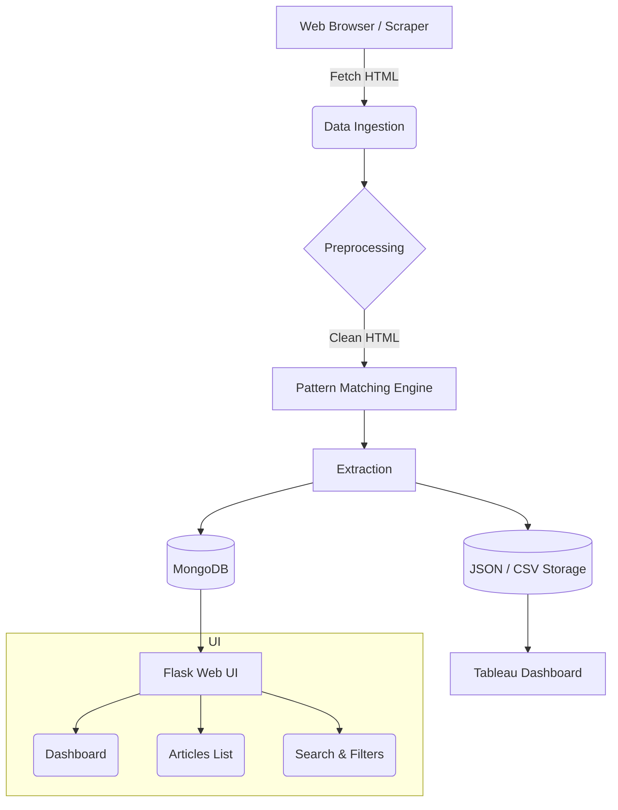

```mermaid
graph TD
    A[Web Browser / Scraper] -->|Fetch HTML| B(Data Ingestion)
    B --> C{Preprocessing}
    C -->|Clean HTML| D[Pattern Matching Engine]
    D --> E[Extraction]
    E --> F[(JSON / CSV Storage)]
    E --> G[(MongoDB)]
    G --> H[Flask Web UI]
    F --> I[Tableau Dashboard]
    
    subgraph UI
    H --> J(Dashboard)
    H --> K(Articles List)
    H --> L(Search & Filters)
    end
```
